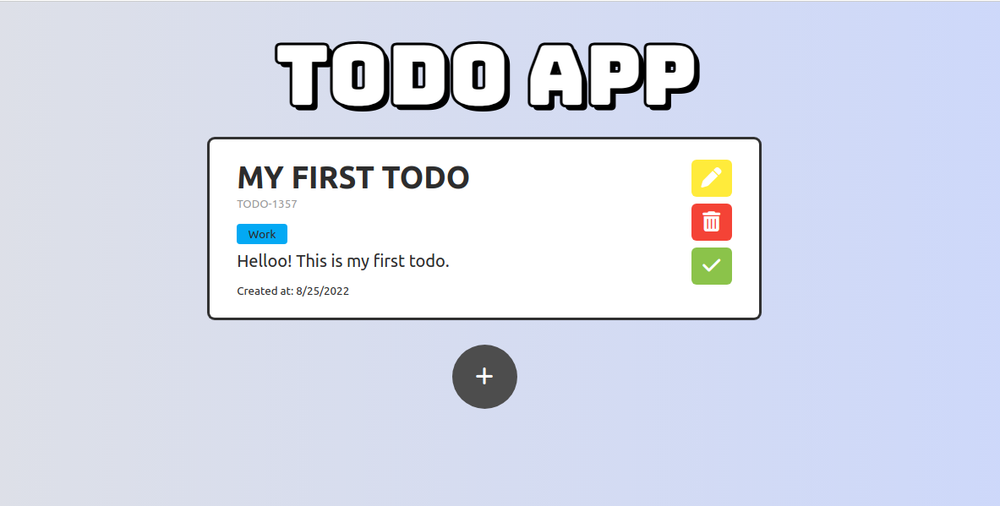
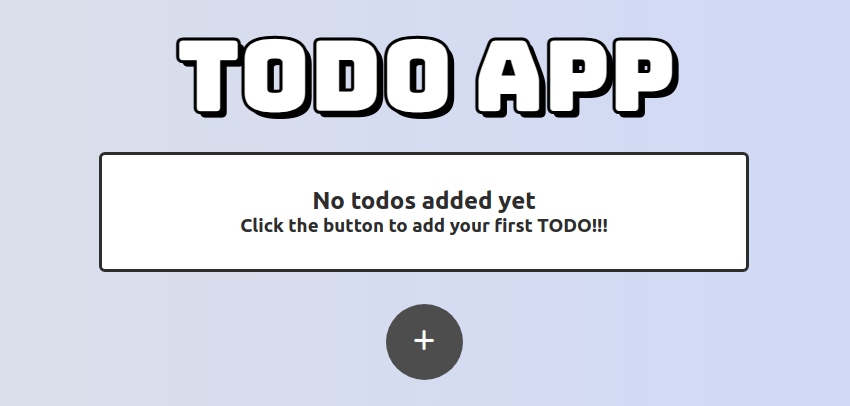
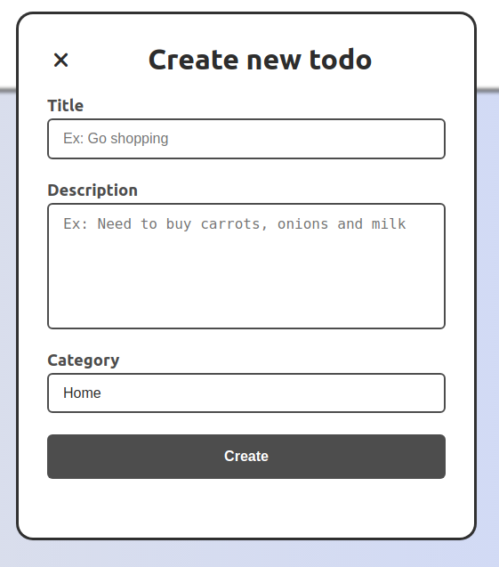
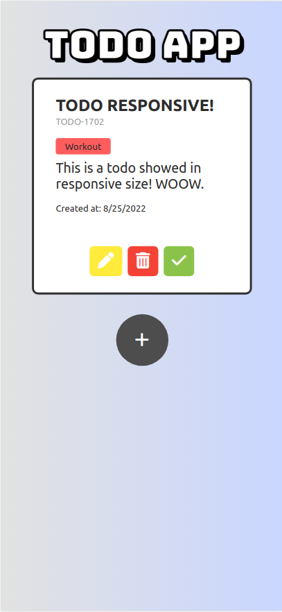

# Todo App: Frontend Challenge

**Todo App** consiste en una aplcación web moderna, que permite al usuario *visualizar, crear, editar y eliminar* sus **TODO's** en tiempo real, proveyendo una interfaz amena y sencilla de comprender.

## Funcionalidades
Tal como se indicó previamente, la aplicación cuenta con múltiples controles para:
- Crear **Todos**
- Editar **Todos**
- Visualizar **Todos**
- Eliminar **Todos**
- Marcar **Todos** como completados

## Tecnologías utilizadas
Para llevar a cabo el desarrollo de esta aplicación web, se utilizó, como *framework / librería* principal: **React JS** con **Typescript**.

Para el estilado de la interfaz de usuario, se utilizó **CSS** puro con su enfoque a **módulos** (CSS modules).

No se hizo uso de ningún tipo de librerías extra para realizar la implementación de las funcionalidades presentadas, ya que la simplicidad del proyecto no lo ameritaba.

## Flujo de información
Con respecto al flujo de información en la aplicación, se hizo uso de la **API de Context** proveída por **React JS**, a fin de centralizar la toda la lógica referente a la página de **Todos** en un mismo *provider*. De esta forma, se garantiza la consistencia de la información; asi como simplifica la gestion de la data por parte de los diferentes componentes que forman parte de dicha página.

Se tomó la decision de utilizar **Context** debido a que se consideró una herramienta que cumplía con su trabajo principal de distribuir la información de los **Todos**.

De esta forma, fueron descartadas las posibilidades de:
- Manejar los estados desde el la página en sí y enviar la información a través de props.
- Hacer uso de un gestor de estado global (como Redux).

## Detalles extra
A fin de dar un giro de tuerca a la funcionalidad principal de la aplicación (gestionar **todos**); se integró:

- Un modal para la **creación y edición** de los **todos**. El mismo se apertura y muestra el formulario a rellenar para realizar las acciones previamente descritas.
- Un selector de **categorías**, el cual permite *taggear* a un **todo** con una categoría específica.

### Notas relevantes:
- La aplicación cuenta con **responsive design** para mobile.
- La aplicación esta desarrolla 100% a nivel de cliente (frontend) y la información de los todos es almacenada en el **Context**, por lo que no existe persistencia de ningún tipo.

## Imágenes

